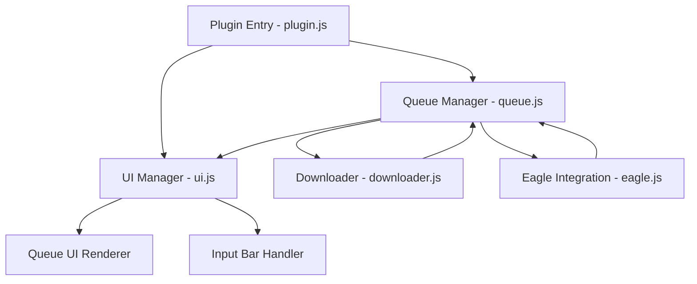
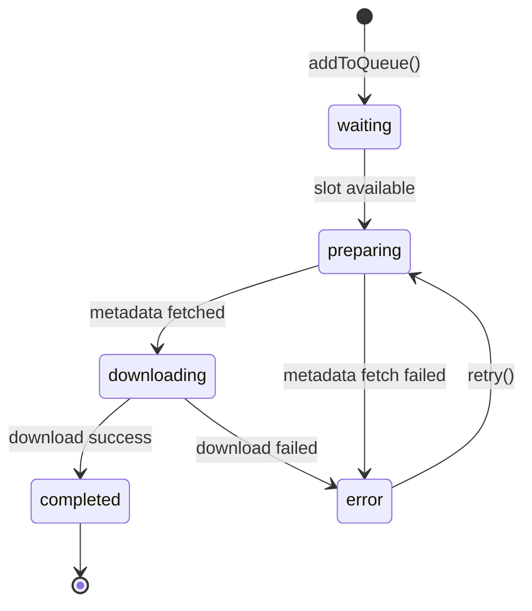

# Design Document: Download Queue Manager

## Overview

The Download Queue Manager transforms the Eagle Video Downloader plugin from a single-download tool into a multi-task queue system. The design maintains the existing yt-dlp download functionality while adding queue state management, concurrent processing, and a redesigned UI that displays multiple download items simultaneously.

The architecture follows a modular approach with clear separation between queue logic (js/queue.js), UI rendering (js/ui.js), and the existing download functionality (js/downloader.js). The design ensures backward compatibility while enabling new queue-based workflows.

Key design principles:

- **Non-blocking operations**: New downloads can be added while others are in progress
- **Concurrent processing**: Up to 3 simultaneous downloads with automatic queue progression
- **State-driven UI**: UI updates reactively based on queue state changes
- **Minimal refactoring**: Existing download logic remains largely unchanged

## Architecture

### System Components



### Component Responsibilities

**Queue Manager (js/queue.js)**

- Maintains queue state (array of download items)
- Manages concurrent download slots (max 3)
- Dispatches downloads to the downloader module
- Emits state change events for UI updates
- Handles retry logic for failed downloads

**UI Manager (js/ui.js)**

- Renders the queue list UI
- Handles input bar interactions
- Updates individual download item displays
- Manages scroll behavior
- Applies design system styles

**Plugin Entry (js/plugin.js)**

- Initializes the queue manager
- Sets up event listeners
- Coordinates between queue and UI
- Handles plugin lifecycle events

**Downloader (js/downloader.js)**

- Executes individual video downloads (unchanged)
- Reports progress to queue manager
- Returns download results

### Data Flow

1. User submits URL via Input Bar
2. UI Manager validates URL and passes to Queue Manager
3. Queue Manager creates Download Item and adds to queue
4. Queue Manager checks available slots and starts download if possible
5. Downloader executes download and reports progress
6. Queue Manager updates Download Item state
7. UI Manager receives state change event and re-renders affected item
8. On completion, Queue Manager imports to Eagle and starts next queued item

## Components and Interfaces

### Queue Manager Module (js/queue.js)

```javascript
// Queue state structure
const queueState = {
  items: [],           // Array of DownloadItem objects
  activeSlots: 0,      // Current number of active downloads
  maxSlots: 3,         // Maximum concurrent downloads
  nextId: 1            // Auto-incrementing ID counter
};

// DownloadItem structure
interface DownloadItem {
  id: number;
  url: string;
  title: string;
  source: string;        // e.g., "YouTube", "Vimeo"
  format: string;        // e.g., "MP4"
  resolution: string;    // e.g., "1080p"
  fileSize: string;      // e.g., "45.2 MB"
  state: 'waiting' | 'preparing' | 'downloading' | 'completed' | 'error';
  progress: number;      // 0-100
  speed: string;         // e.g., "2.5 MB/s"
  eta: string;           // e.g., "00:45"
  error: string | null;
  timestamp: number;     // Creation timestamp
  filePath: string | null; // Path after download
}

// Public API
function addToQueue(url: string): number;
function retryDownload(itemId: number): void;
function getQueueState(): DownloadItem[];
function clearCompleted(): void;
function onStateChange(callback: (item: DownloadItem) => void): void;
```

**Key Functions:**

- `addToQueue(url)`: Creates a new DownloadItem, adds to queue, and attempts to start download
- `processQueue()`: Internal function that starts downloads for waiting items if slots available
- `updateItemState(id, updates)`: Updates a specific item and triggers state change event
- `handleDownloadProgress(id, progress)`: Updates progress information for an active download
- `handleDownloadComplete(id, result)`: Marks download complete, imports to Eagle, processes next item
- `handleDownloadError(id, error)`: Marks download as error, frees slot, processes next item

### UI Manager Module (js/ui.js)

**New Functions:**

```javascript
// Queue UI rendering
function renderQueueUI(): void;
function renderDownloadItem(item: DownloadItem): HTMLElement;
function updateDownloadItem(itemId: number, item: DownloadItem): void;
function scrollToTop(): void;

// Input bar (replaces existing form)
function setupInputBar(): void;
function clearInputBar(): void;
function showInputError(message: string): void;
```

**HTML Structure:**

```html
<div class="app">
  <header>
    <!-- Logo, title, close button (unchanged) -->
  </header>

  <main>
    <!-- Queue list container -->
    <div id="queueContainer" class="queue-container">
      <!-- Download items rendered here -->
    </div>

    <!-- Fixed input bar at bottom -->
    <div class="input-bar">
      <input type="text" id="urlInput" placeholder="Paste video URL..." />
      <button id="addButton">Download</button>
    </div>
  </main>
</div>
```

**Download Item Template:**

```html
<div class="download-item" data-item-id="{id}">
  <div class="item-header">
    <div class="item-title">{title}</div>
    <button class="item-retry" style="display: none;">Retry</button>
  </div>
  <div class="item-metadata">
    {source} - {format} - {resolution} - {fileSize}
  </div>
  <div class="item-progress">
    <div class="progress-bar-container">
      <div class="progress-bar-fill" style="width: {progress}%"></div>
      <div class="progress-text">{statusText}</div>
    </div>
  </div>
</div>
```

### Plugin Entry Module (js/plugin.js)

**Modified Initialization:**

```javascript
const queue = require("./queue");
const ui = require("./ui");

eagle.onPluginCreate(async (plugin) => {
  // Existing initialization (language, theme, binaries)
  await initializeBinaries();

  // Initialize queue manager
  queue.initialize();

  // Set up queue state change listener
  queue.onStateChange((item) => {
    ui.updateDownloadItem(item.id, item);
  });

  // Set up input bar
  ui.setupInputBar();

  // Render initial empty queue
  ui.renderQueueUI();
});

// New: Handle add to queue
function handleAddToQueue(url) {
  if (!ui.isValidUrl(url)) {
    ui.showInputError(t("invalidUrl"));
    return;
  }

  const itemId = queue.addToQueue(url);
  ui.clearInputBar();
  ui.scrollToTop();
}
```

## Data Models

### DownloadItem State Machine



**State Descriptions:**

- **waiting**: Item is queued but no download slot available
- **preparing**: Fetching video metadata (title, size, etc.)
- **downloading**: Actively downloading video file
- **completed**: Download finished and imported to Eagle
- **error**: Download failed with error message

### Queue State Persistence (Optional)

```javascript
// LocalStorage schema
interface QueueStorage {
  version: 1,
  items: DownloadItem[],  // Only completed items
  timestamp: number
}

// Storage key
const STORAGE_KEY = 'eagle-video-downloader-queue';
```

## Correctness Properties

_A property is a characteristic or behavior that should hold true across all valid executions of a system—essentially, a formal statement about what the system should do. Properties serve as the bridge between human-readable specifications and machine-verifiable correctness guarantees._

### Property 1: Non-Blocking Queue Addition

_For any_ valid video URL and any current queue state (including active downloads), adding the URL to the queue should create a new Download_Item without blocking or interrupting existing downloads.

**Validates: Requirements 1.1, 5.5**

### Property 2: Independent Item State Tracking

_For any_ Download_Item in the queue, updating its state should not affect the state of any other Download_Item in the queue.

**Validates: Requirements 1.2**

### Property 3: State Persistence on Completion and Error

_For any_ Download_Item that transitions to "completed" or "error" state, the item should remain in the queue with its final state and associated data (error message, file path) preserved.

**Validates: Requirements 1.3, 1.4, 9.5**

### Property 4: Complete Metadata Storage

_For any_ Download_Item created, the Queue_Manager should store all required fields: title, source URL, format, resolution, file size, and a unique identifier.

**Validates: Requirements 2.1, 2.4**

### Property 5: Metadata Update Preservation

_For any_ Download_Item that successfully fetches metadata, the retrieved information (title, source, format, resolution, fileSize) should be stored in the item and remain unchanged throughout the download lifecycle.

**Validates: Requirements 2.2**

### Property 6: Progress Tracking Completeness

_For any_ Download_Item in "downloading" state, the Queue_Manager should track and update the progress percentage, download speed, and estimated time remaining.

**Validates: Requirements 2.3**

### Property 7: Unique Identifier Assignment

_For any_ two Download_Items in the queue, their ID values should be unique and never collide.

**Validates: Requirements 2.4**

### Property 8: Timestamp Update on State Change

_For any_ Download_Item, when its state changes, the timestamp field should be updated to reflect the time of the state change.

**Validates: Requirements 2.5**

### Property 9: Complete Queue Display

_For any_ queue state, the Queue_UI should render all Download_Items in the queue as visible DOM elements in the scrollable list.

**Validates: Requirements 3.1**

### Property 10: Newest-First Display Order

_For any_ new Download_Item added to the queue, it should appear at the top of the Queue_UI list, above all previously added items.

**Validates: Requirements 3.3**

### Property 11: Timely UI Updates

_For any_ Download_Item state change, the Queue_UI should reflect the updated state within 500ms.

**Validates: Requirements 3.4**

### Property 12: Complete Item Rendering

_For any_ Download_Item displayed in the Queue_UI, the rendered element should include the video title (14px, white, with ellipsis), metadata line (source, format, resolution, size in 12px at 40% opacity), and appropriate state visualization (progress bar for downloading, status text for other states).

**Validates: Requirements 4.1, 4.2, 4.3, 4.4**

### Property 13: Error Display with Retry

_For any_ Download_Item in "error" state, the Queue_UI should display the error message in red text and show a retry button.

**Validates: Requirements 4.6, 9.3**

### Property 14: URL Validation

_For any_ string submitted through the Input_Bar, if it does not match the http/https URL format, the system should reject it, display an error message, and not create a Download_Item.

**Validates: Requirements 5.2, 5.4**

### Property 15: Successful Submission Behavior

_For any_ valid URL submitted through the Input_Bar, the system should add it to the queue and clear the input field.

**Validates: Requirements 5.3**

### Property 16: Input Bar Availability During Downloads

_For any_ queue state (including when downloads are in progress), the Input_Bar should remain enabled and accept new URL submissions.

**Validates: Requirements 5.5, 1.1**

### Property 17: Concurrent Slot Management

_For any_ queue state, the number of Download_Items in "downloading" state should never exceed 3, and when a download completes or fails, if there are items in "waiting" state, the next waiting item should automatically transition to "preparing" state.

**Validates: Requirements 8.1, 8.2, 8.3**

### Property 18: Progress Update Frequency

_For any_ Download_Item in "downloading" state, the Queue_Manager should emit progress updates at intervals of 500ms or less.

**Validates: Requirements 8.4**

### Property 19: State Transition Validity

_For any_ Download_Item, state transitions should only follow valid paths: waiting → preparing → downloading → (completed | error), or error → preparing (on retry).

**Validates: Requirements 1.2, 9.4**

### Property 20: Error Message Preservation

_For any_ Download_Item that enters "error" state, the error message should be stored and remain accessible until the item is retried or removed from the queue.

**Validates: Requirements 9.1, 9.5**

### Property 21: Retry State Reset

_For any_ Download_Item in "error" state, when retry is triggered, the item should transition to "waiting" state with progress reset to 0, error cleared, and speed/eta cleared.

**Validates: Requirements 9.4**

### Property 22: Error Isolation

_For any_ Download_Item that fails, other Download_Items in the queue should continue processing without interruption.

**Validates: Requirements 9.5**

### Property 23: Eagle Import with Complete Metadata

_For any_ Download_Item that completes successfully, the system should import the video to Eagle with all metadata fields: title, source URL, tags (including extractor), and description.

**Validates: Requirements 10.1, 10.2**

### Property 24: Duplicate Detection and Re-download

_For any_ video URL that already exists in Eagle, the system should display a duplicate warning but provide the option to re-download and import again.

**Validates: Requirements 10.3**

### Property 25: Import Error Handling

_For any_ Download_Item where Eagle import fails, the system should display an error message but preserve the downloaded file path and metadata in the item.

**Validates: Requirements 10.4**

### Property 26: Translation Coverage

_For any_ status message displayed in the Queue_UI (preparing, downloading, complete, error messages), the system should use the appropriate translation for the current language (English or Simplified Chinese).

**Validates: Requirements 11.3, 11.4, 11.5**

### Property 27: Persistence Save on Close (Optional Feature)

_For any_ queue state when persistence is enabled, closing the plugin should save all completed Download_Items (up to 50 most recent) to local storage.

**Validates: Requirements 12.1, 12.3**

### Property 28: Persistence Restore on Open (Optional Feature)

_For any_ saved queue state when persistence is enabled, opening the plugin should restore completed Download_Items from local storage without automatically restarting incomplete downloads.

**Validates: Requirements 12.2, 12.4**

## Error Handling

### Error Categories

**Network Errors**

- Timeout during metadata fetch
- Connection lost during download
- yt-dlp binary execution failure

**Validation Errors**

- Invalid URL format
- Unsupported video platform
- Private/restricted video

**Eagle Integration Errors**

- Eagle API unavailable
- Import permission denied
- Duplicate detection failure

### Error Handling Strategy

1. **Graceful Degradation**: Errors in one download should not affect others
2. **User Feedback**: Clear error messages displayed on affected items
3. **Retry Capability**: Users can retry failed downloads with one click
4. **State Preservation**: Error state and message preserved until retry or removal
5. **Logging**: Errors logged to console for debugging

### Error Recovery Flow

```javascript
// In queue.js
async function handleDownloadError(itemId, error) {
  // Update item state
  updateItemState(itemId, {
    state: "error",
    error: error.message || t("downloadFailed"),
  });

  // Free the download slot
  queueState.activeSlots--;

  // Process next waiting item
  processQueue();

  // Emit state change for UI update
  emitStateChange(getItemById(itemId));
}

// Retry function
function retryDownload(itemId) {
  const item = getItemById(itemId);
  if (!item || item.state !== "error") return;

  // Reset item state
  updateItemState(itemId, {
    state: "waiting",
    error: null,
    progress: 0,
    speed: "",
    eta: "",
  });

  // Attempt to start download
  processQueue();
}
```

## Testing Strategy

### Unit Testing

**Queue Manager Tests (js/queue.test.js)**

- Test queue initialization
- Test adding items to queue
- Test slot management (max 3 concurrent)
- Test state transitions
- Test retry functionality
- Test error handling
- Test queue state retrieval

**UI Manager Tests (js/ui.test.js)**

- Test download item rendering
- Test input validation
- Test error display
- Test scroll behavior
- Test item update logic

### Property-Based Testing

Property-based tests will validate the correctness properties defined above using a JavaScript property testing library (fast-check). Each test will run a minimum of 100 iterations with randomized inputs.

**Configuration:**

- Library: fast-check (npm install --save-dev fast-check)
- Minimum iterations: 100 per property
- Tag format: `// Feature: download-queue-manager, Property {N}: {description}`

**Example Property Test:**

```javascript
const fc = require("fast-check");

// Feature: download-queue-manager, Property 2: Concurrent Slot Limit Enforcement
test("concurrent downloads never exceed max slots", () => {
  fc.assert(
    fc.property(
      fc.array(fc.webUrl(), { minLength: 1, maxLength: 20 }),
      async (urls) => {
        const queue = createTestQueue();

        // Add all URLs to queue
        urls.forEach((url) => queue.addToQueue(url));

        // Check at multiple points during processing
        for (let i = 0; i < 10; i++) {
          const state = queue.getQueueState();
          const downloading = state.filter(
            (item) => item.state === "downloading",
          );
          expect(downloading.length).toBeLessThanOrEqual(3);
          await sleep(100);
        }
      },
    ),
    { numRuns: 100 },
  );
});
```

### Integration Testing

**End-to-End Scenarios**

- Add single URL and verify download completion
- Add multiple URLs and verify concurrent processing
- Test retry after network error
- Test duplicate detection with Eagle
- Test UI updates during download progress
- Test window resize and scroll behavior

### Manual Testing Checklist

- [ ] Visual design matches Figma specifications
- [ ] All colors match design system variables
- [ ] Font sizes and weights are correct
- [ ] Border radius and padding match design
- [ ] Progress bar gradient displays correctly
- [ ] Scroll behavior is smooth
- [ ] Input bar remains fixed at bottom
- [ ] Error states display clearly
- [ ] Retry buttons appear and function correctly
- [ ] Eagle import works for all video sources
- [ ] i18n translations display correctly in both languages

## Design System Implementation

### CSS Variables

```css
:root {
  --bg1: #191a1d;
  --bg2: #131416;
  --fg1: #ffffff;
  --fg2: rgba(255, 255, 255, 0.4);
  --brand: #3197ff;
  --stroke: rgba(255, 255, 255, 0.04);
  --error: #f56c6c;
  --success: #4caf50;
}
```

### Component Styles

**Queue Container**

```css
.queue-container {
  flex: 1;
  overflow-y: auto;
  padding: 12px;
  max-height: calc(100vh - 48px - 60px); /* viewport - header - input bar */
}
```

**Download Item**

```css
.download-item {
  background: var(--bg2);
  border-radius: 10px;
  padding: 12px;
  margin-bottom: 8px;
}

.item-title {
  font-size: 14px;
  color: var(--fg1);
  font-weight: 500;
  white-space: nowrap;
  overflow: hidden;
  text-overflow: ellipsis;
}

.item-metadata {
  font-size: 12px;
  color: var(--fg2);
  margin-top: 4px;
}

.progress-bar-container {
  height: 16px;
  background: rgba(255, 255, 255, 0.05);
  border-radius: 999px;
  margin-top: 8px;
  position: relative;
  overflow: hidden;
}

.progress-bar-fill {
  height: 100%;
  background: linear-gradient(90deg, #3297ff, #4caf50);
  border-radius: 999px;
  transition: width 0.3s ease;
}

.progress-text {
  position: absolute;
  top: 50%;
  left: 50%;
  transform: translate(-50%, -50%);
  font-size: 10px;
  font-weight: 500;
  color: var(--fg1);
}
```

**Input Bar**

```css
.input-bar {
  display: flex;
  gap: 8px;
  padding: 12px;
  background: var(--bg1);
  border-top: 1px solid var(--stroke);
}

#urlInput {
  flex: 1;
  height: 36px;
  padding: 0 12px;
  background: var(--bg2);
  border: 1px solid var(--stroke);
  border-radius: 8px;
  color: var(--fg1);
  font-size: 12px;
}

#addButton {
  height: 36px;
  padding: 8px 12px;
  background: var(--brand);
  border: none;
  border-radius: 8px;
  color: var(--fg1);
  font-size: 12px;
  font-weight: 500;
  cursor: pointer;
}
```

## Migration Strategy

### Phase 1: Add Queue Module

- Create js/queue.js with queue state management
- Implement core queue functions (add, update, process)
- Add unit tests for queue logic

### Phase 2: Update UI Module

- Add queue rendering functions to js/ui.js
- Create download item template and styling
- Implement input bar component

### Phase 3: Restructure HTML

- Update index.html with new layout
- Add CSS for queue container and items
- Apply design system variables

### Phase 4: Integrate Plugin Entry

- Modify js/plugin.js to use queue manager
- Connect queue state changes to UI updates
- Remove old single-download UI code

### Phase 5: Testing and Refinement

- Run unit tests and property tests
- Perform integration testing
- Verify design system compliance
- Test i18n translations

### Backward Compatibility

The existing download functionality in js/downloader.js remains unchanged. The queue manager wraps this functionality, ensuring that:

- Single downloads still work through the queue (queue of 1)
- Eagle integration API calls remain identical
- Binary initialization (yt-dlp, ffmpeg) is unchanged
- i18n system continues to function

## Performance Considerations

### Memory Management

- Limit queue history to 50 items (configurable)
- Clear completed items older than 24 hours (optional)
- Clean up temporary files after Eagle import

### UI Rendering

- Use document fragments for batch DOM updates
- Debounce scroll events
- Only update visible items during rapid state changes
- Virtual scrolling for queues > 20 items (future enhancement)

### Download Optimization

- Maintain 3 concurrent downloads for optimal throughput
- Reuse yt-dlp process where possible
- Stream progress updates (don't buffer)

## Future Enhancements

1. **Drag-to-Reorder**: Allow users to reorder queue items
2. **Pause/Resume**: Pause individual downloads
3. **Batch Operations**: Clear all, retry all failed
4. **Download Presets**: Save format/quality preferences
5. **Queue Persistence**: Restore queue on plugin restart
6. **Download History**: View and re-download previous items
7. **Thumbnail Preview**: Show video thumbnails in queue items
