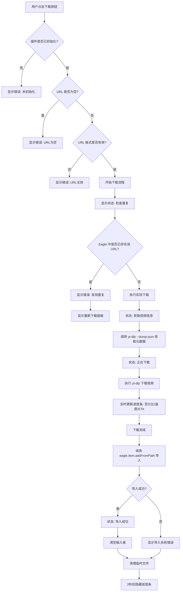

# 下载流程详解

本文档详细说明用户点击「下载」按钮后的完整交互逻辑。

## 流程图



---

## 步骤详解

### 1. 表单提交 (`plugin.js`)

用户点击下载按钮触发表单 `submit` 事件：

```javascript
document
  .getElementById("downloadForm")
  .addEventListener("submit", async (e) => {
    e.preventDefault();
    if (!isDownloading) {
      await handleDownload();
    }
  });
```

### 2. 输入验证 (`plugin.js` → `handleDownload()`)

依次检查三项条件：

| 检查项           | 失败时的错误提示 |
| ---------------- | ---------------- |
| 插件是否初始化   | `notInitialized` |
| URL 是否为空     | `emptyUrl`       |
| URL 格式是否有效 | `invalidUrl`     |

### 3. 重复检查 (`eagle.js` → `checkDuplicateByUrl()`)

调用 Eagle API 查询是否已存在相同 URL 的视频：

```javascript
const items = await eagle.item.get({ url: url });
if (items && items.length > 0) {
  return items[0]; // 返回已存在的项目
}
```

如果发现重复：

- 显示错误信息及已存在项目的名称
- 提供「重新下载」链接供用户选择

### 4. 获取视频信息 (`downloader.js` → `getVideoInfo()`)

执行 yt-dlp 获取视频元数据：

```javascript
const args = ["--dump-json", "--no-warnings", url];
const output = await execYtDlp(args);
const info = JSON.parse(output);
```

**提取的元数据字段：**

| 字段          | 说明         |
| ------------- | ------------ |
| `title`       | 视频标题     |
| `description` | 视频描述     |
| `duration`    | 时长（秒）   |
| `thumbnail`   | 缩略图 URL   |
| `uploader`    | 上传者       |
| `extractor`   | 来源平台     |
| `webpage_url` | 原始网页 URL |

### 5. 下载视频 (`downloader.js` → `downloadVideo()`)

构建 yt-dlp 下载命令：

```javascript
const args = [
  url,
  "-o",
  outputPath,
  "-f",
  "bestvideo+bestaudio/best", // 最佳画质
  "--merge-output-format",
  "mp4", // 合并为 MP4
  "--no-playlist", // 不下载播放列表
  "--ffmpeg-location",
  ffmpegDir, // ffmpeg 路径
];
```

**特殊 URL 处理：**

- Vimeo: 自动转换为 `player.vimeo.com/video/ID` 格式以绕过登录限制

### 6. 进度反馈

解析 yt-dlp 输出的进度信息：

```javascript
const progressMatch = output.match(
  /\[download\]\s+(\d+\.?\d*)%\s+of\s+~?(\S+)\s+at\s+(\S+)\s+ETA\s+(\S+)/,
);
```

**更新的进度信息：**

| 字段           | 说明         |
| -------------- | ------------ |
| `percent`      | 下载百分比   |
| `totalSize`    | 文件总大小   |
| `currentSpeed` | 当前下载速度 |
| `eta`          | 预计剩余时间 |

### 7. 导入到 Eagle (`eagle.js` → `importToEagle()`)

调用 Eagle API 导入视频：

```javascript
const importOptions = {
  name: metadata.title, // 视频标题
  website: sourceUrl, // 来源 URL
  tags: [metadata.extractor], // 标签（来源平台）
  annotation: metadata.description, // 备注（视频描述）
};

await eagle.item.addFromPath(videoPath, importOptions);
```

### 8. 清理收尾 (`plugin.js`)

导入成功后：

1. 清空 URL 输入框
2. 删除临时目录中的视频文件
3. 2 秒后隐藏进度条

```javascript
cleanup(downloadedPath); // 删除临时文件
setTimeout(() => {
  hideProgress();
  updateStatus("");
}, 2000);
```

---

## 文件结构对照

| 文件               | 职责                     |
| ------------------ | ------------------------ |
| `js/plugin.js`     | 主入口，协调整体流程     |
| `js/downloader.js` | 视频下载核心逻辑         |
| `js/eagle.js`      | Eagle API 交互           |
| `js/ui.js`         | UI 状态更新              |
| `js/i18n.js`       | 多语言支持               |
| `js/binary.js`     | yt-dlp/ffmpeg 二进制管理 |
